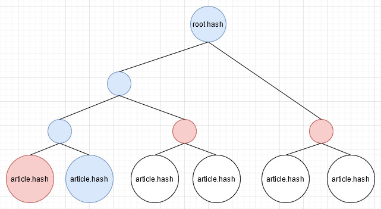

# Fundamental

## 区块链登记原理

1. BCH 主要用于交易，但是交易可以附带留言
2. 如果我把一篇文章s的内容作为交易留言，并且在时刻t该交易被将写入区块链上，再经过几个区块的确定，这个交易从数学上就会变得不可修改。这就是区块链用于版权登记的原因。
3. 再这个例子中，我们可以证明，文章s在时刻t被发表了。如果s里面由你的个人身份声明，那么就可以证明你的文章s在时刻t被发表了。


## 字节数目问题

### 文章字节数问题
- 交易留言字节数目越大，那么需要支付的手续费也越高

解决方案：只送hash。

**定理1**：对于文章s，我们选取哈希算法h。如果h(s)在t时刻被登记，那么就等价于s在t时刻被登记。其中，h需要是安全的（以人类的科技水平不可碰撞）。


### 多文件问题

假设我们要登记s1, s2，...sn我们只需要这样：
1. 创建一个文本文件txt，里面由n行，第1行是h(s1)，第2行是h(s2)，以此类推
2. 将h(txt)送到区块链上

**定理2**：对于文章s=s1+...+sn，s被登记在区块链上，可以推出，s1 ... sn被登记在了区块链上。说人话就是：如果这篇文章被登记了，那么它的某一个片段也被登记了。


### 多用户问题

当用户数目增多，那么这个txt文件也会增大。假设有n个用户，每个用户登记1篇文章。那么这个txt文件的大小为n，需要分发给n个用户，带宽资源为n*n，每一个用户的储存开销为n。无论是服务器带宽和用户仓库，都扛不住。

所以，我们用二叉树解决这个问题。


我们采用二叉树的结构，以10w篇文章为叶子节点，向上构建一个二叉树。然后将树根上链。



例如，对于第二篇文章，蓝色的节点是从第二篇文章到root的路径。但是，对于路径我们是不需要保存的。我们需要保存的是红色的部分。

用户不再需要储存10w个sha256，而是只需储存recipe和其他的一些信息，复杂度为logN。当N=10w时，logN = 16.6，这个复杂度相当可观。


## 形式化

定义Recipe文法如下：

```
RecipeTree -> RecipeNode
RecipeNode -> hash(RecipeNode) | RecipeNode + RecipeNode | StringLiteral | ByteLiteral
hash -> sha256 | sha384 | sha512 // 任意安全的哈希函数都可以
```

将定理1和2形式化：
- **任取满足Recipe文法的源文件x，记x运行的结果是rootHash，那么将rootHash登记到区块链，等价将x登记到区块链。**

That's all.

## 实现细节

本项目选取了Recipe文法的一个子集。

```
RecipeTree -> RecipeNode
RecipeNode -> hash(RecipeNode + RecipeNode) | hash(RecipeNode) | StringLiteral
hash -> sha256
```

```go
type RecipeNode struct {
	Left          *RecipeNode `json:"left,omitempty"`
	Right         *RecipeNode `json:"right,omitempty"`
	Literal       string      `json:"literal,omitempty"`
	LiteralToHash string      `json:"literalToHash,omitempty"`
}

func (p *RecipeNode) CalculateOutput() string {
	if p.Literal != "" {
		return p.Literal
	}

	if p.LiteralToHash != "" {
		return utils.GetSHA256(p.LiteralToHash)
	}

	return utils.GetSHA256(p.Left.GetOutput() + p.Right.GetOutput())
}

```

