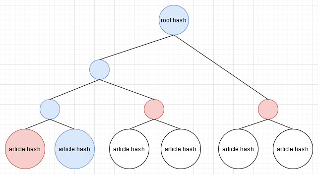

# 实现细节

## 上链过程

[ElectronCash](https://github.com/Electron-Cash/Electron-Cash) 是一个BCH的开源轻钱包，主要支持手动转账。如果勾选“OP_Return”，就可以附带信息。

例如 [这个交易](https://blockchair.com/bitcoin-cash/transaction/e65588a6ac6e0332c29eb3dcf1e074a07784cb6ffe654bf814a63ac897bc6482) 的 页面正下方的 OP_RETURN 就是我储存在区块链上的附带信息。

当然，ElectronCash具备提供给开发者的API。通过这个API，可以实现编程触发转账。

## 初步设计

**初步思路：每一篇文章上一次链。**

如果按照一次转账的手续费为546satoshi，即0.00000546BCH，那么一次上链大概需要花费 0.017 RMB。如果有10w文章，那么就是 1700 RMB。这个开销无法接受。

## 减少上链次数

我们可以将这10w篇文章的10w个sha256放进一个txt文件，然后只需将这个txt的sha256上链就行了。

优点：省钱。

缺点：储存空间占用过大。这10w个用户，都需要持有这个txt文件。这造成的带宽开销和客户的储存开销是非常巨大的。

## 节省空间：Recipe

我们采用二叉树的结构，以10w篇文章为叶子节点，向上构建一个二叉树。然后将树根上链。

例如，对于第二篇文章，蓝色的节点是从第二篇文章到root的路径。但是，对于路径我们是不需要保存的。我们需要保存的是红色的部分。

这些红色的部分就是`recipe`。用户不再需要储存10w个sha256，而是只需储存recipe和其他的一些信息，复杂度为logN。当N=10w时，logN = 16.6，这个复杂度相当可观。

这些recipe是构建从文章的hash到roothash的路径的必要条件，详细的证明和演示请看 [validate.md](./validate.md)